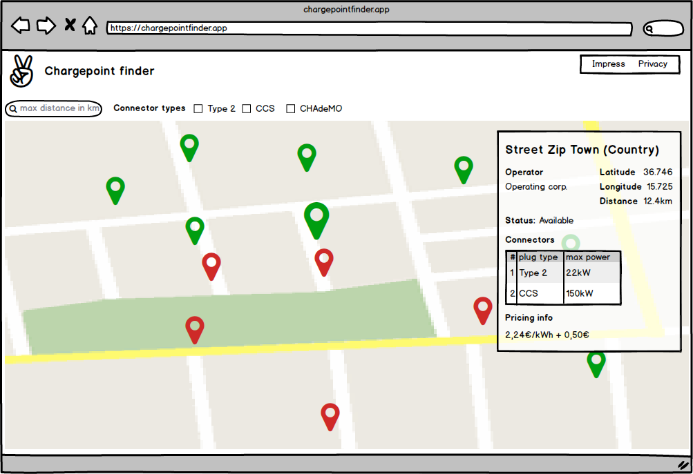

# Charge Map App

## User Story
As a User I want to see all charging stations filtered by type in a specific radius on a map, to see how many of them in my area have a connector type that fits  my electric car requirements.

## Acceptance Criteria
- Radius is editable
- Initial radius is 10km
- Charging stations can be filtered by the connector types Type 2, CHAdeMO and CCS
- Initially all three connector type filters are activated
- Other connector types must be ignored
- A map centered with the user's current location is shown
- Charging stations are shown as markers
  - Available charging stations will be shown green
  - Not available charging Stations will be shown red
- On clicking at a charging  station,  the following info will be displayed:
  - Street
  - Zip
  - Town
  - Country
  - Latitude
  - Longitude
  - Operator
  - Distance (calculated from user's current location to the geo point of the charging station)
  - Status as Available or Occupied
  - Connectors
    - Number
    - Plug Type
    - Max Power
    - Pricing Info
- The map updates every
  - Radius change
  - Connector type chnage
  - Center change
- App should be provided as git repository or zip
## Nice to have
- Implement Marker clustering
- Create a Docker container that runs the application
- Unit /e2e Tests

## API
[https://api.openchargemap.io/v3/poi](https://api.openchargemap.io/v3/poi)

Docs: [https://openchargemap.io/site/develop/api](https://openchargemap.io/site/develop/api)

Connector Type Ids:
- Type 2: 25
- CHAdeMO: 2
- CCS: 33

## Wireframe
